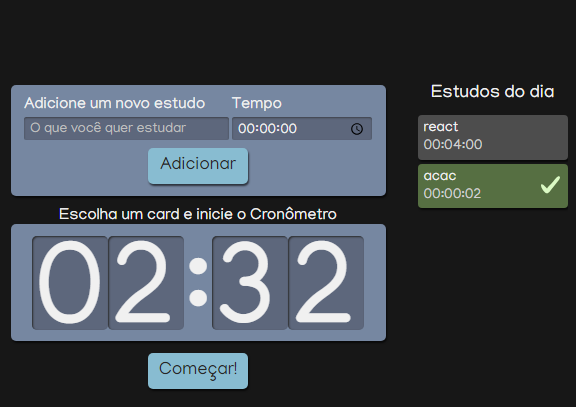

  

  

 Ao longo do curso, adquiri habilidades essenciais para o desenvolvimento web com React. Aprendi a criar um projeto sólido usando Create React App e a estabelecer uma base consistente com imports absolutos e normalize.css. Também utilizei boas práticas de CSS, como variáveis e arquivos separados para breakpoints, resultando em um código mais organizado.
 

Explorando recursos como classnames, pude aplicar estilos condicionais e integrar com CSS Modules. Além disso, aprendi a importar SVGs como componentes React usando o SVGR. Compreendi a importância do tratamento de imports estáticos no React, incluindo a importação dinâmica de arquivos pela pasta "public".

Essas habilidades me capacitam a desenvolver projetos web modernos e eficientes com React, aplicando boas práticas e maximizando a flexibilidade no uso de recursos estáticos. Estou animado para aplicar esse conhecimento em futuros projetos e continuar aprimorando minhas habilidades como desenvolvedor React.

## Tecnologias utilizadas no projeto
* HTML
* SCSS
* Typescript
* React

## Screenshots

